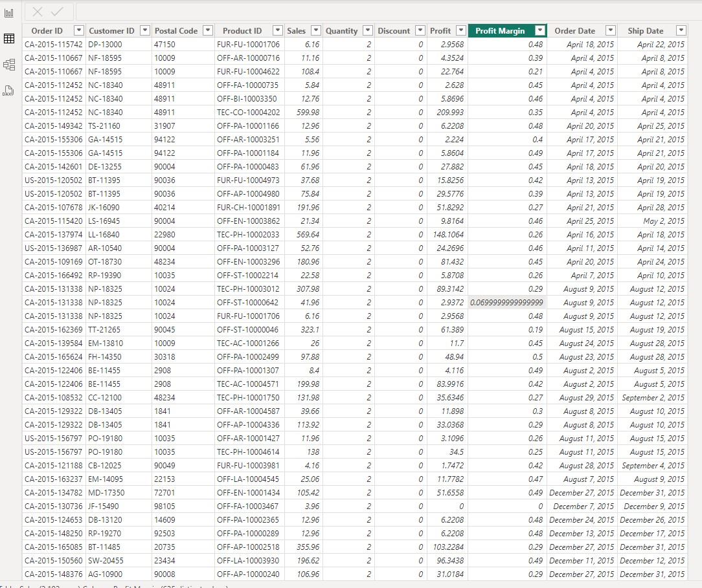
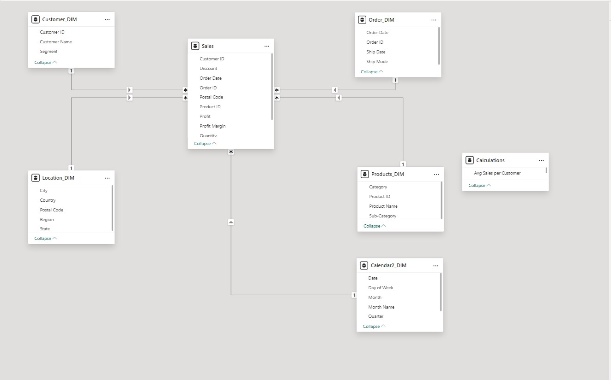
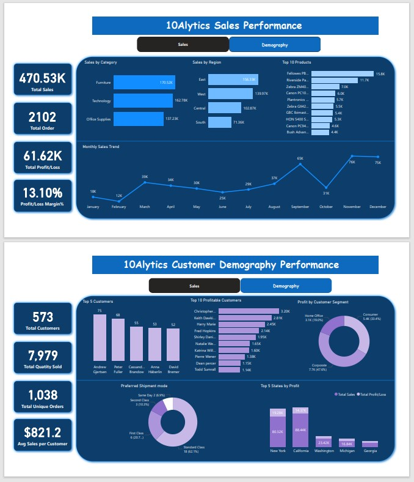
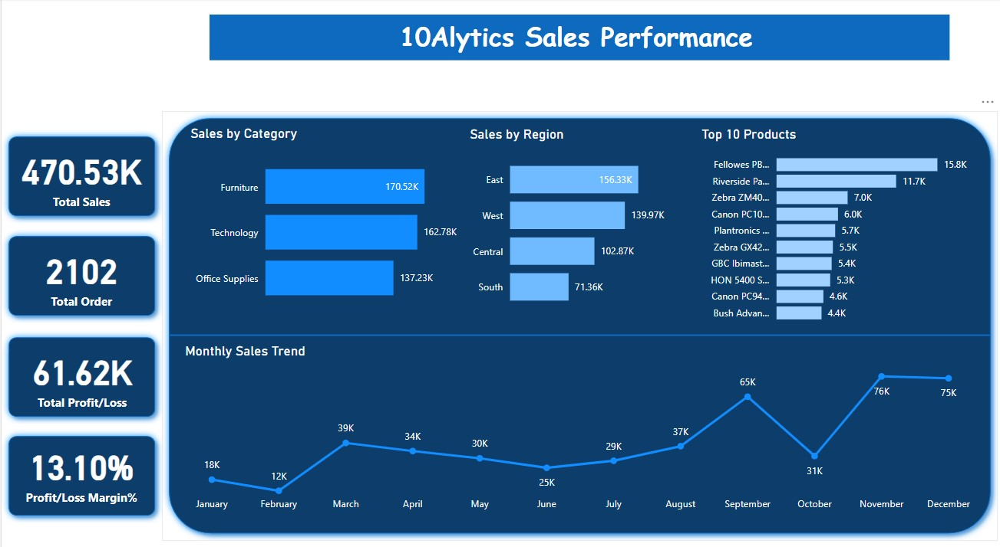

# 10Alytics-Sales-Performance-Analysis with Power BI

## Table of Contents
- [Project Overview](#project-overview)
- [Project Objective](#project-objective)
- [Dataset](#dataset)
- [Skill](#skill)
- [Schema Building](#schema-building)
- [Visualization](#visualization)
- [Analysis](#analysis)
- [Conclusion](#conclusion)
- [Recommendation](#recommendation)

  
## Project Overview

The goal of this project is to analyze sales performance at 10Alytics by examining data from various product categories and regions nationwide. The insights gained 
from this analysis will be used to develop strategies that optimize sales outcomes and boost profitability. In addition to identifying trends, the project will 
provide actionable recommendations to help guide decision-making and improve overall business performance.

## Project Objectives
1.	Identify patterns and trends in sales transactions across product categories.
2.	Optimize sales performance and profitability across regions nationwide.
3.	Provide actionable recommendations based on the analysis.

## Dataset

This is a dummy dataset provided by 10Alytics to demonstrate knowledge/skill of using Power BI.
The dataset consist of sales data for the Year 2015 (January to December).

## Skills 
- Bookmarkings,
- DAX,
- Page navigation,
- Schemas development

### Sales Table

Sales Table (the **Fact Table**) used in the analysis

 ## Schema Building

The schema developed is a star schema with 5-dimension tables and 1 fact table. The dimension tables are all joined to the fact table with one-to-many relationship.

## Visualization
The report was presented with dashboard
1.	10Alytics Sales Performance dashboard
2.	Demography performance dashboard

## Analysis

### Sales performance 

- The **Total Sales** was **$470,530** with **2,102 Orders** made and **Total Profit** was **$61,620** with **Profit Margin** of **13.10%**.

### Monthly sales
The most sales was in **November** with sales of **$76,000** while the lowest sales was in the month of **February** with sales of **$12,000**.

### Sales by region
The highest Sales was in **East region ($156,330)** followed by **West region ($139,970)** then **Central region ($102,870)**. Least Sales was in **South region** with **$71,360**.

### Demography performance

- **Total Customers** were **573**
- **Total Quantity Sold** in the year under consideration (2015) were **7,979**
- The most profitable **Customer Segment** was **Consumer (33.4%)**
- While the **Top 5 Customers** were Andrew Gjersten, Peter Fuller, Cassandra Branden, Anna Haberlin and David Bremer, the **Top 5 Profitable Customers** were Christoper Martinez, Keith Dawkins,
  Harry Marie, Fred Hopkins and Shirley Daniels.
- Top 5 states by profit include New york , California, Washington, Michigan and Georgia.
- Standard class is the most prefered mode of shipment.

## Conclusion 
The Furniture category recorded the highest sales across all segments. The stores are divided into three main segments, each with various subcategories. Additionally, the eastern region of the country 
achieves the highest sales performance for the year analyzed.
 
## Recommendations
- Increase inventory of top-performing products in each subcategory, as they are the most frequently purchased.
- More Incentives should be created to improve more sales generally across the country.
- Expand sales efforts in the eastern and western regions of the country.
- Reduce stock of low-performing products to allocate capital for high-demand items and improve cash flow.
- Commission a study to investigate poor product performance in the southern region and apply insights to enhance sales.
